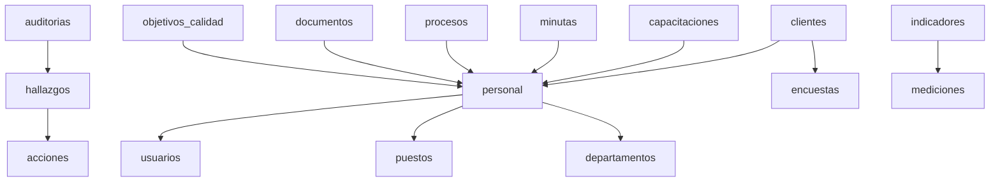

# 🗄️ 05 - Mapa de Base de Datos - SGC ISO 9001

**📅 Última Actualización: 22/8/2025**
**🔄 Generado Automáticamente:** Este documento se actualiza cada 20 minutos

## 🏗️ Arquitectura de Base de Datos

### 🔧 Motor de Base de Datos
- **Tipo:** SQLite con Turso (LibSQL)
- **Versión:** LibSQL 0.5.0+
- **Cliente:** @libsql/client
- **Arquitectura:** Multi-tenant (por organización)

## 📊 Esquema Actual de Tablas

### 📋 Gestión de Personal

#### 📊 **personal**
- **Propósito:** Información de empleados y colaboradores
- **Campos principales:** id, nombre, apellido, email, departamento_id, puesto_id
- **Multi-tenant:** ✅ Sí

#### 📊 **departamentos**
- **Propósito:** Estructura organizacional de la empresa
- **Campos principales:** id, nombre, descripcion, responsable_id
- **Multi-tenant:** ✅ Sí

#### 📊 **puestos**
- **Propósito:** Descripciones de cargos y responsabilidades
- **Campos principales:** id, nombre, descripcion, departamento_id
- **Multi-tenant:** ✅ Sí

#### 📊 **competencias**
- **Propósito:** Matriz de competencias y habilidades
- **Campos principales:** id, nombre, descripcion, tipo, nivel_requerido
- **Multi-tenant:** ✅ Sí

#### 📊 **usuarios**
- **Propósito:** Cuentas de acceso al sistema
- **Campos principales:** id, email, password, nombre, rol, personal_id
- **Multi-tenant:** ✅ Sí

### 📋 Gestión de Procesos

#### 📊 **procesos**
- **Propósito:** Procesos del sistema de gestión de calidad
- **Campos principales:** id, nombre, descripcion, tipo, responsable_id
- **Multi-tenant:** ✅ Sí

#### 📊 **documentos**
- **Propósito:** Control documental del SGC
- **Campos principales:** id, titulo, codigo, version, tipo, contenido
- **Multi-tenant:** ✅ Sí

#### 📊 **normas**
- **Propósito:** Puntos de la norma ISO 9001:2015
- **Campos principales:** id, codigo, titulo, descripcion, categoria
- **Multi-tenant:** ✅ Sí

#### 📊 **objetivos_calidad**
- **Propósito:** Objetivos y metas de calidad
- **Campos principales:** id, nombre, descripcion, meta, responsable_id
- **Multi-tenant:** ✅ Sí

### 📋 Gestión de Auditorías

#### 📊 **auditorias**
- **Propósito:** Planificación y ejecución de auditorías
- **Campos principales:** id, titulo, tipo, fecha_programada, auditor_lider_id
- **Multi-tenant:** ✅ Sí

#### 📊 **hallazgos**
- **Propósito:** Registro de no conformidades y observaciones
- **Campos principales:** id, auditoria_id, tipo, descripcion, responsable_id
- **Multi-tenant:** ✅ Sí

#### 📊 **acciones**
- **Propósito:** Acciones correctivas y preventivas
- **Campos principales:** id, hallazgo_id, tipo, descripcion, responsable_id
- **Multi-tenant:** ✅ Sí

### 📋 Gestión de Indicadores

#### 📊 **indicadores**
- **Propósito:** Definición de KPIs y métricas
- **Campos principales:** id, nombre, descripcion, formula, meta
- **Multi-tenant:** ✅ Sí

#### 📊 **mediciones**
- **Propósito:** Datos de medición de indicadores
- **Campos principales:** id, indicador_id, valor, fecha_medicion
- **Multi-tenant:** ✅ Sí

### 📋 Gestión de Clientes (CRM)

#### 📊 **clientes**
- **Propósito:** Base de datos de clientes y prospectos
- **Campos principales:** id, nombre, email, telefono, vendedor_id
- **Multi-tenant:** ✅ Sí

#### 📊 **productos**
- **Propósito:** Catálogo de productos y servicios
- **Campos principales:** id, nombre, descripcion, codigo, precio
- **Multi-tenant:** ✅ Sí

#### 📊 **encuestas**
- **Propósito:** Encuestas de satisfacción del cliente
- **Campos principales:** id, titulo, cliente_id, puntuacion, estado
- **Multi-tenant:** ✅ Sí

### 📋 Gestión de Capacitación

#### 📊 **capacitaciones**
- **Propósito:** Programas de formación y desarrollo
- **Campos principales:** id, nombre, instructor, fecha_inicio, estado
- **Multi-tenant:** ✅ Sí

### 📋 Gestión de Reuniones

#### 📊 **minutas**
- **Propósito:** Actas de reuniones y seguimiento
- **Campos principales:** id, titulo, fecha_reunion, objetivo, responsable_id
- **Multi-tenant:** ✅ Sí


## 📈 Estadísticas en Tiempo Real

### 📊 Registros por Tabla

- 👤 **personal:** 9 registros
- 🏢 **departamentos:** 6 registros
- 💼 **puestos:** 9 registros
- 🎯 **competencias:** 6 registros
- 👥 **usuarios:** 5 registros
- ⚙️ **procesos:** 5 registros
- 📄 **documentos:** 2 registros
- 📜 **normas:** 54 registros
- 🎯 **objetivos_calidad:** 11 registros
- 🔍 **auditorias:** 2 registros
- ⚠️ **hallazgos:** 0 registros
- ✅ **acciones:** 0 registros
- 📊 **indicadores:** 4 registros
- 📈 **mediciones:** 0 registros
- 👤 **clientes:** 0 registros
- 🛍️ **productos:** 3 registros
- 📋 **encuestas:** 0 registros
- 🎓 **capacitaciones:** 2 registros
- 📝 **minutas:** 6 registros

### 📈 Resumen
- **Total de registros:** 124
- **Tablas activas:** 19


## 🔗 Relaciones entre Tablas

### 🌐 Diagrama de Relaciones Principales



## 🔐 Configuración Multi-Tenant

Todas las tablas incluyen el campo `organization_id` para segregar datos por organización.

## 🚀 Índices y Optimizaciones

### 📊 Índices Principales
```sql
-- Índices principales para performance
CREATE INDEX idx_personal_organization ON personal(organization_id);
CREATE INDEX idx_auditorias_organization ON auditorias(organization_id);
CREATE INDEX idx_hallazgos_auditoria ON hallazgos(auditoria_id);
CREATE INDEX idx_acciones_hallazgo ON acciones(hallazgo_id);
CREATE INDEX idx_mediciones_indicador ON mediciones(indicador_id);
CREATE INDEX idx_usuarios_email ON usuarios(email);

-- Índices de búsqueda
CREATE INDEX idx_personal_nombre ON personal(nombre, apellido);
CREATE INDEX idx_clientes_nombre ON clientes(nombre);
CREATE INDEX idx_documentos_titulo ON documentos(titulo);
```

---

*Mapa de base de datos generado automáticamente el 22/8/2025 - Sistema SGC ISO 9001*